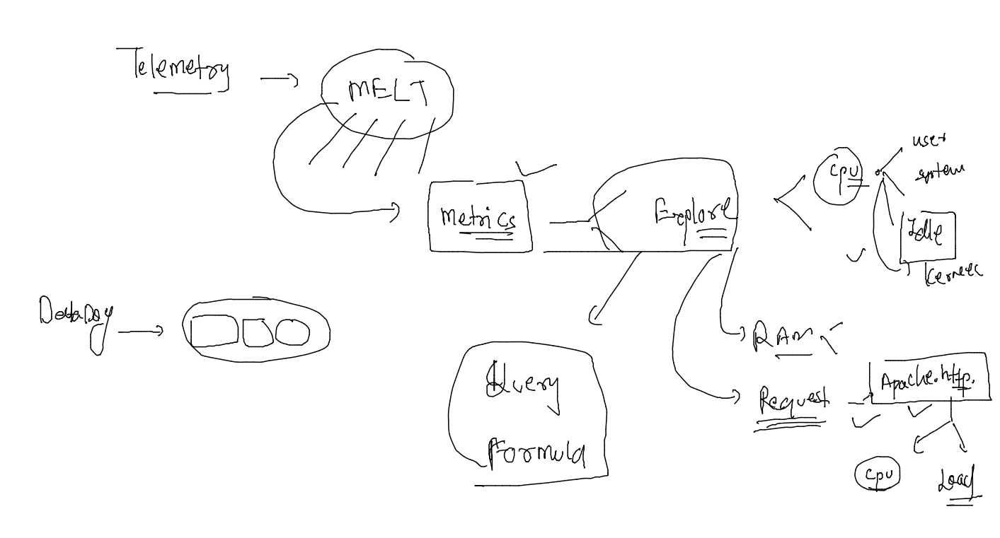
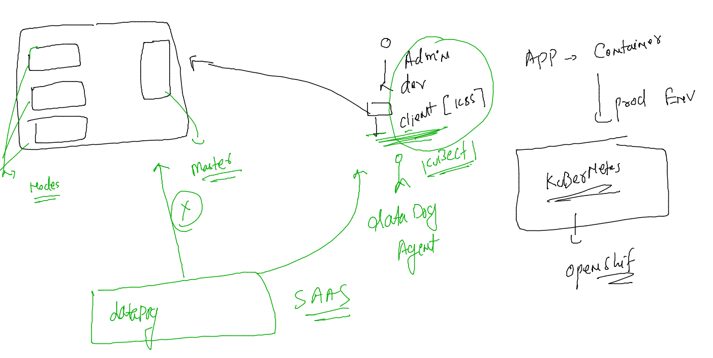

# voda-datadog-11thjuly2022


### datadog revision 

### code share URL 

[code_share](https://codeshare.io/X8XK8E)

### starting docker based agent manually --

```
[root@ashu-vm ~]# docker  start  dd-agent 
dd-agent
[root@ashu-vm ~]# docker  ps
CONTAINER ID   IMAGE                      COMMAND                  CREATED      STATUS                 PORTS                                   NAMES
21da87118bd1   ashuapp:v1                 "/docker-entrypoint.…"   2 days ago   Up 3 hours             0.0.0.0:1122->80/tcp, :::1122->80/tcp   ashuc1
21075cf5f1fd   gcr.io/datadoghq/agent:7   "/bin/entrypoint.sh"     3 days ago   Up 3 hours (healthy)   8125/udp, 8126/tcp                      dd-agent
[root@ashu-vm ~]# 

```

### make these changes for persistent docker based datadog agent auto start

```
[root@ashu-vm ~]# systemctl enable --now  docker 
[root@ashu-vm ~]# docker  update  --restart  always  dd-agent 
dd-agent
[root@ashu-vm ~]# docker  start  dd-agent  
dd-agent
```

### metrics explorer 



### datadog with kubernetes 



### lets connect with k8s first using kubectl 

```
curl -LO "https://dl.k8s.io/release/$(curl -L -s https://dl.k8s.io/release/stable.txt)/bin/linux/amd64/kubectl"
 	mv  kubectl  /usr/bin/
  chmod +x  /usr/bin/kubectl 
```
### lets connect to k8s server 

```
kubectl  version --client  -o yaml 
clientVersion:
  buildDate: "2022-07-13T14:30:46Z"
  compiler: gc
  gitCommit: aef86a93758dc3cb2c658dd9657ab4ad4afc21cb
  gitTreeState: clean
  gitVersion: v1.24.3
  goVersion: go1.18.3
  major: "1"
  minor: "24"
  platform: linux/amd64
kustomizeVersion: v4.5.4

```


### lets configure to connect 

```
[root@ashu-vm ~]# whoami
root
[root@ashu-vm ~]# pwd
/root
[root@ashu-vm ~]# wget  http://172.31.20.255/admin.conf 
--2022-07-15 07:07:20--  http://172.31.20.255/admin.conf
Connecting to 172.31.20.255:80... connected.
HTTP request sent, awaiting response... 200 OK
Length: 5637 (5.5K) [text/plain]
Saving to: 'admin.conf'

100%[===============================================================================>] 5,637       --.-K/s   in 0s      

2022-07-15 07:07:20 (484 MB/s) - 'admin.conf' saved [5637/5637]

[root@ashu-vm ~]# ls
Flaskex  admin.conf  ashuapp  ddagent-install.log  project-html-website  setup.sh  web1
[root@ashu-vm ~]# 
[root@ashu-vm ~]# mkdir  ~/.kube 
[root@ashu-vm ~]# cp -v admin.conf   ~/.kube/config  
'admin.conf' -> '/root/.kube/config'
[root@ashu-vm ~]# 
[root@ashu-vm ~]# kubectl  get nodes
NAME     STATUS   ROLES           AGE    VERSION
master   Ready    control-plane   4h9m   v1.24.3
worker   Ready    <none>          4h8m   v1.24.3
```


