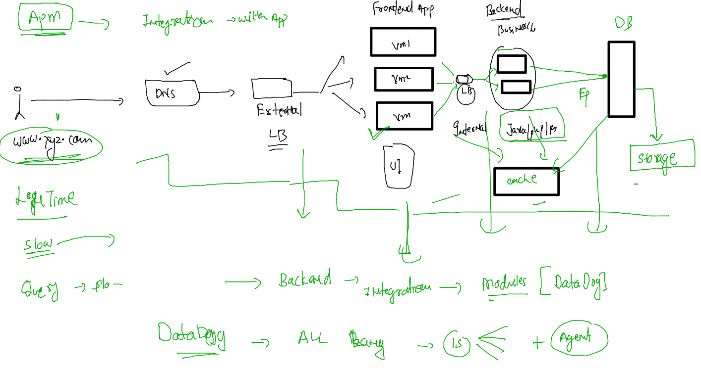

# voda-datadog-11thjuly2022


### code share link 

[click to join ](https://codeshare.io/DZJnRY)

### Understanding APM  



### install php on ec2-vm with apache2 installed 

### yum update

```
yum -y update
yum -y install https://rpms.remirepo.net/enterprise/remi-release-7.rpm
yum -y install https://dl.fedoraproject.org/pub/epel/epel-release-latest-7.noarch.rpm
yum-config-manager --disable 'remi-php*'
amazon-linux-extras enable php8.0
yum clean metadata
yum install php-{pear,cgi,pdo,common,curl,mbstring,gd,mysqlnd,gettext,bcmath,json,xml,fpm,intl,zip}
 yum  install php
 
```

### write sample phpcode 

```
[root@vikas-vm ~]# cd /var/www/html/
[root@vikas-vm html]# ls
LICENSE  README.md  css  fonts  img  index.html
[root@vikas-vm html]# vim  test.php
[root@vikas-vm html]# cat  test.php 
<?php

echo phpinfo();

?>

```

### restart vm -- 

```
[root@vikas-vm html]# systemctl reboot 
Connection to 172.31.20.202 closed by remote host.
Connection to 172.31.20.202 closed.
```


