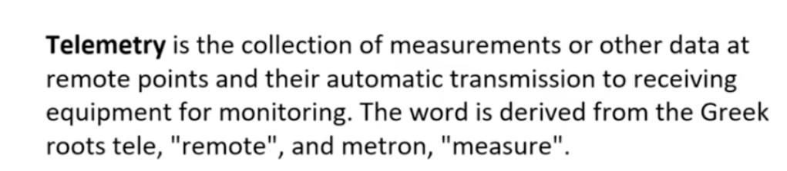
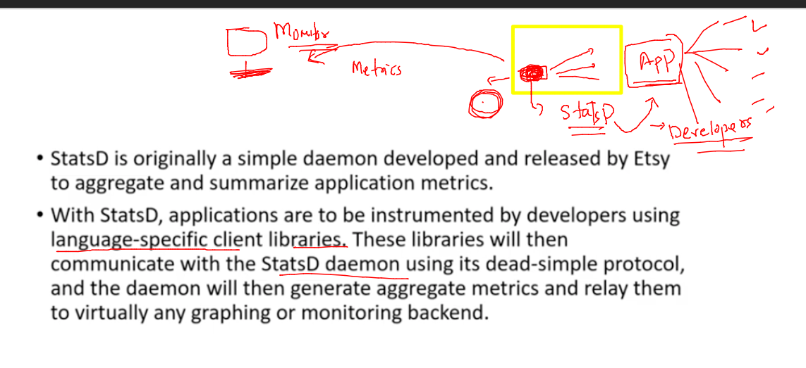
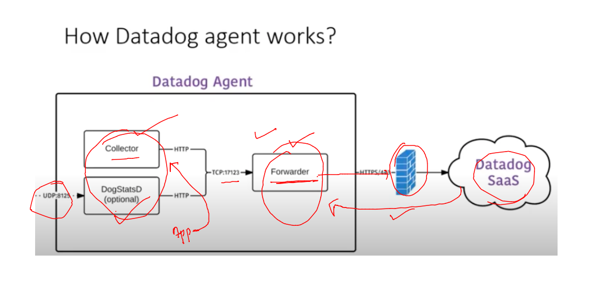
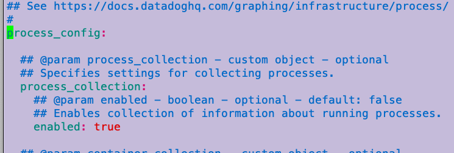

# voda-datadog-11thjuly2022


### Monitoring 


### Observalibity vs monitoring 


### pillers of OBservability 


### datadog introduction 


### pricing 


### application Infra 


### planning infro in aws cloud 

### connecting linux vm via ssh 

```
fire@ashutoshhs-MacBook-Air ~ % ssh   ec2-user@184.73.12.243
The authenticity of host '184.73.12.243 (184.73.12.243)' can't be established.
ECDSA key fingerprint is SHA256:8nNOk0DD8ITpko+eOq6cAXWZdFJtxq3rPKoRe5BRoBw.
Are you sure you want to continue connecting (yes/no/[fingerprint])? yes
Warning: Permanently added '184.73.12.243' (ECDSA) to the list of known hosts.
ec2-user@184.73.12.243: Permission denied (publickey,gssapi-keyex,gssapi-with-mic).
fire@ashutoshhs-MacBook-Air ~ % 


```

### give hostname to your VM 

```
[ec2-user@ip-172-31-18-110 ~]$ sudo -i 
[root@ip-172-31-18-110 ~]# whoami
root
[root@ip-172-31-18-110 ~]# hostnamectl set-hostname  ashu-vm 
[root@ip-172-31-18-110 ~]# exit
logout
[ec2-user@ip-172-31-18-110 ~]$ sudo -i
[root@ashu-vm ~]# 
[root@ashu-vm ~]# 


```

### datadog agent 


### amazon linux based agent v7 selection 


### by script we are installing datadog agent v7 

```
[root@ashu-vm ~]# DD_AGENT_MAJOR_VERSION=7 DD_API_KEY="" DD_SITE="datadoghq.com" bash -c "$(curl -L https://s3.amazonaws.com/dd-agent/scripts/install_script.sh)"
  % Total    % Received % Xferd  Average Speed   Time    Time     Time  Current
                                 Dload  Upload   Total   Spent    Left  Speed
100 29326  100 29326    0     0   793k      0 --:--:-- --:--:-- --:--:--  818k

* Datadog Agent install script v1.9.0


* Installing YUM sources for Datadog

* Installing the Datadog Agent package

Failed to set locale, defaulting to C
Loaded plugins: extras_suggestions, langpacks, priorities, update-motd
Cleaning repos: amzn2-core amzn2extra-docker amzn2extra-kernel-5.10 datadog
17 metadata files removed
6 sqlite files removed
0 metadata files removed
  Installing package: datadog-agent


```

### final check 

```
Installed:
  datadog-agent.x86_64 1:7.37.1-1                                               

Complete!

* Adding your API key to the Datadog Agent configuration: /etc/datadog-agent/datadog.yaml


* Setting SITE in the Datadog Agent configuration: /etc/datadog-agent/datadog.yaml

/bin/systemctl
* Starting the Datadog Agent...


Your Datadog Agent is running and functioning properly. It will continue
to run in the background and submit metrics to Datadog.

If you ever want to stop the Datadog Agent, run:

     systemctl stop datadog-agent

And to run it again run:

     systemctl start datadog-agent


```

### checking configuration file of datadog agent 

```
[root@ashu-vm ~]# cd  /etc/datadog-agent/
[root@ashu-vm datadog-agent]# 
[root@ashu-vm datadog-agent]# 
[root@ashu-vm datadog-agent]# 
[root@ashu-vm datadog-agent]# ls
auth_token    conf.d                install_info                 selinux
checks.d      datadog.yaml          runtime-security.d           system-probe.yaml.example
compliance.d  datadog.yaml.example  security-agent.yaml.example

```

### start / checking datadog agent service 

```
[root@ashu-vm datadog-agent]# systemctl status datadog-agent 
● datadog-agent.service - Datadog Agent
   Loaded: loaded (/usr/lib/systemd/system/datadog-agent.service; enabled; vendor preset: disabled)
   Active: active (running) since Mon 2022-07-11 06:32:48 UTC; 5min ago
 Main PID: 693 (agent)
   CGroup: /system.slice/datadog-agent.service
           └─693 /opt/datadog-agent/bin/agent/agent run -p /opt/datadog-agent/run/agent.pid


```

### Understanding telemetry 



### Understanding StatsD 



### agent understanding 



### checking more 

```
[root@ashu-vm datadog-agent]# datadog-agent  status 
Getting the status from the agent.

===============
Agent (v7.37.1)
===============

  Status date: 2022-07-11 07:28:43.932 UTC (1657524523932)
  Agent start: 2022-07-11 06:39:39.16 UTC (1657521579160)
  Pid: 2142
  Go Version: go1.17.11
  Python Version: 3.8.11
  Build arch: amd64
  Agent flavor: agent
  Check Runners: 4
  Log Level: info


```

### now time for enable the process monitoring 

```
[root@ashu-vm datadog-agent]# 
[root@ashu-vm datadog-agent]# grep -in  process_config   datadog.yaml  
1147:## @param process_config - custom object - optional
1152:# process_config:
1170:  ## @env DD_PROCESS_CONFIG_ENABLED - string - optional - default: "false"
1179:  ## @env DD_PROCESS_CONFIG_EXPVAR_PORT - string - optional - default: 6062
1190:  ## @env DD_PROCESS_CONFIG_LOG_FILE - string - optional
1196:  ## @env DD_PROCESS_CONFIG_INTERVALS_CONTAINER - integer - optional - default: 10

```

### after making indented changes you restart service 




```
[root@ashu-vm datadog-agent]# systemctl restart  datadog-agent
[root@ashu-vm datadog-agent]# systemctl status   datadog-agent
● datadog-agent.service - Datadog Agent
   Loaded: loaded (/usr/lib/systemd/system/datadog-agent.service; enabled; vendor preset: disabled)
   Active: active (running) since Mon 2022-07-11 08:06:27 UTC; 9s ago
 Main PID: 18903 (agent)
   CGroup: /system.slice/datadog-agent.service
           └─18903 /opt/datadog-agent/bin/agent/agent run -p /opt/datadog-agent/run/agent.pid
```


### apache httpd server setup and host webapp in Vm 


### setup 

```
 yum  install httpd  git -y
 
 git clone  https://github.com/microsoft/project-html-website.git
 
 [root@ashu-vm ~]# ls
ddagent-install.log  project-html-website  setup.sh
[root@ashu-vm ~]# 
[root@ashu-vm ~]# cp -rfv  project-html-website/*  /var/www/html/
```


### start webapp server 

```
[root@ashu-vm ~]# systemctl start  httpd
[root@ashu-vm ~]# systemctl status   httpd
● httpd.service - The Apache HTTP Server
   Loaded: loaded (/usr/lib/systemd/system/httpd.service; disabled; vendor preset: disabled)
   Active: active (running) since Mon 2022-07-11 08:25:23 UTC; 5s ago
     Docs: man:httpd.service(8)
 Main PID: 22716 (httpd)
   Status: "Processing requests..."
   CGroup: /system.slice/httpd.service
           ├─22716 /usr/sbin/httpd -DFOREGROUND
           ├─22717 /usr/sbin/httpd -DFOREGROUND
           ├─22719 /usr/sbin/httpd -DFOREGROUND
           ├─22728 /usr/sbin/httpd -DFOREGROUND
           ├─22741 /usr/sbin/httpd -DFOREGROUND
           └─22743 /usr/sbin/httpd -DFOREGROUND

Jul 11 08:25:23 ashu-vm systemd[1]: Starting The Apache HTTP Server...
Jul 11 08:25:23 ashu-vm httpd[22716]: AH00558: httpd: Could not reliably determine the server's fully qualifie...ssage
Jul 11 08:25:23 ashu-vm systemd[1]: Started The Apache HTTP Server.
Hint: Some lines were ellipsized, use -l to show in full.
[root@ashu-vm ~]# systemctl enable httpd
Created symlink from /etc/systemd/system/multi-user.target.wants/httpd.service to /usr/lib/systemd/system/httpd.service.

```

### logs by apache httpd only 

```
[root@ashu-vm ~]# cd  /var/log/httpd/
[root@ashu-vm httpd]# 
[root@ashu-vm httpd]# ls
access_log  error_log
[root@ashu-vm httpd]# tail -f  access_log 
::1 - - [11/Jul/2022:08:27:08 +0000] "OPTIONS * HTTP/1.0" 200 - "-" "Apache/2.4.53 () (internal dummy connection)"
::1 - - [11/Jul/2022:08:27:10 +0000] "OPTIONS * HTTP/1.0" 200 - "-" "Apache/2.4.53 () (internal dummy connection)"
103.59.75.244 - - [11/
```

## apache httpd with datadogagent 

### httpd server configuration detials 

```
[root@ashu-vm httpd]# cd  /etc/httpd/
[root@ashu-vm httpd]# ls
conf  conf.d  conf.modules.d  logs  modules  run  state
[root@ashu-vm httpd]# cd  conf
[root@ashu-vm conf]# ls
httpd.conf  magic
[root@ashu-vm conf]# cd ../conf.d/
[root@ashu-vm conf.d]# ls
README  autoindex.conf  userdir.conf  welcome.conf
```


