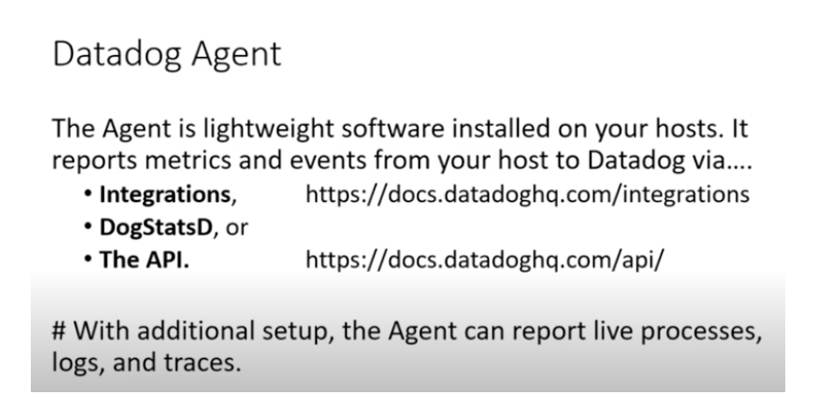

# voda-datadog-11thjuly2022


### datadog agent -- uses integration to observe a particular service like docker / k8s / sshd / httpd 



### datadog agent logs 

```
[root@kiran-vm datadog]# cd /var/log/
[root@kiran-vm log]# ls
amazon    btmp                   cloud-init.log  dmesg               httpd    maillog   secure    wtmp
audit     chrony                 cron            dmesg.old           journal  messages  spooler   yum.log
boot.log  cloud-init-output.log  datadog         grubby_prune_debug  lastlog  sa        tallylog
[root@kiran-vm log]# cd  datadog/
[root@kiran-vm datadog]# ls
agent.log  process-agent.log  trace-agent.log
[root@kiran-vm datadog]# 

```

### remove agent from LInux VM 

```
 11  systemctl stop datadog-agent
   12  yum remove datadog-agent 
   13  userdel -r dd-agent 
   14  rm -rf /opt/datadog  /etc/datadog-agent/  /var/log/datadog/  
```


### Including windows / Mac in your datadog account 


