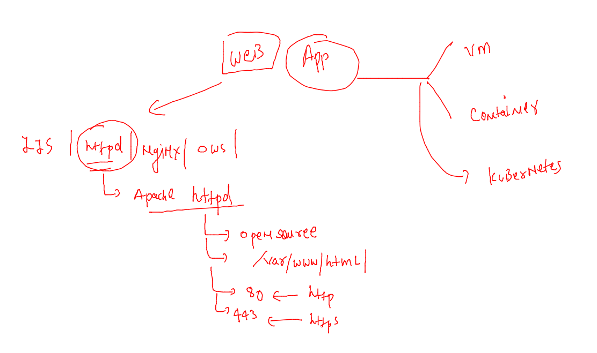

# voda-datadog-11thjuly2022


### datadog agent -- uses integration to observe a particular service like docker / k8s / sshd / httpd 


### datadog agent logs 

```
[root@kiran-vm datadog]# cd /var/log/
[root@kiran-vm log]# ls
amazon    btmp                   cloud-init.log  dmesg               httpd    maillog   secure    wtmp
audit     chrony                 cron            dmesg.old           journal  messages  spooler   yum.log
boot.log  cloud-init-output.log  datadog         grubby_prune_debug  lastlog  sa        tallylog
[root@kiran-vm log]# cd  datadog/
[root@kiran-vm datadog]# ls
agent.log  process-agent.log  trace-agent.log
[root@kiran-vm datadog]# 

```

### remove agent from LInux VM 

```
 11  systemctl stop datadog-agent
   12  yum remove datadog-agent 
   13  userdel -r dd-agent 
   14  rm -rf /opt/datadog  /etc/datadog-agent/  /var/log/datadog/  
```


### Integrations in Datadog saas platform 

```
[root@ashu-vm datadog-agent]# cd  /etc/datadog-agent/
[root@ashu-vm datadog-agent]# ls
auth_token    conf.d                install_info                 selinux
checks.d      datadog.yaml          runtime-security.d           system-probe.yaml.example
compliance.d  datadog.yaml.example  security-agent.yaml.example
[root@ashu-vm datadog-agent]# 
[root@ashu-vm datadog-agent]# 
[root@ashu-vm datadog-agent]# cd  conf.d/
[root@ashu-vm conf.d]# ls
activemq.d               disk.d           ignite.d                   nagios.d                    snowflake.d
activemq_xml.d           dns_check.d      io.d                       network.d                   solr.d
aerospike.d              docker.d         istio.d                    nfsstat.d                   sonarqube.d
airflow.d                druid.d          jboss_wildfly.d            nginx.d                     spark.d
amazon_msk.d     
```

### Integration of apache httpd server to datadog agent 



### Revision of httpd server 

```
[root@ashu-vm ~]# yum install httpd -y 
Failed to set locale, defaulting to C
Loaded plugins: extras_suggestions, langpacks, priorities, update-motd
amzn2-core                                                                                       | 3.7 kB  00:00:00     
Package httpd-2.4.53-1.amzn2.x86_64 already installed and latest version
Nothing to do
[root@ashu-vm ~]# cd /etc/httpd/
[root@ashu-vm httpd]# ls
conf  conf.d  conf.modules.d  logs  modules  run  state
[root@ashu-vm httpd]# cd conf
[root@ashu-vm conf]# ls
httpd.conf  httpd.conf.backup  magic
[root@ashu-vm conf]# 
[root@ashu-vm conf]# 
[root@ashu-vm conf]# 
[root@ashu-vm conf]# cd /var/www/html/
[root@ashu-vm html]# ls
LICENSE  README.md  css  fonts  img  index.html
[root@ashu-vm html]# 
[root@ashu-vm html]# systemctl restart  httpd 
[root@ashu-vm html]# systemctl status   httpd 
● httpd.service - The Apache HTTP Server
   Loaded: loaded (/usr/lib/systemd/system/httpd.service; enabled; vendor preset: disabled)
   Active: active (running) since Tue 2022-07-12 05:34:10 UTC; 6s ago
     Docs: man:httpd.service(8)
 Main PID: 11779 (httpd)
   Status: "Processing requests..."
    Tasks: 47
   Memory: 9.8M
   CGroup: /system.slice/httpd.service
           ├─11779 /usr/sbin/httpd -DFOREGROUND
           ├─11780 /usr/sbin/httpd -DFOREGROUND
           ├─11782 /usr/sbin/httpd -DFOREGROUND
           ├─11796 /usr/sbin/httpd -DFOREGROUND
           ├─11804 /usr/sbin/httpd -DFOREGROUND
           └─11810 /usr/sbin/httpd -DFOREGROUND

Jul 12 05:34:10 ashu-vm systemd[1]: Starting The Apache HTTP Server...
Jul 12 05:34:10 ashu-vm httpd[11779]: AH00558: httpd: Could not reliably determine the server's fully qualified...essage
Jul 12 05:34:10 ashu-vm systemd[1]: Started The Apache HTTP Server.
Hint: Some lines were ellipsized, use -l to show in full.
```

## for integration with apache httpd 

### agent side first 

```
root@ashu-vm html]# cd  /etc/datadog-agent/
[root@ashu-vm datadog-agent]# ls
auth_token    conf.d                install_info                 selinux
checks.d      datadog.yaml          runtime-security.d           system-probe.yaml.example
compliance.d  datadog.yaml.example  security-agent.yaml.example
[root@ashu-vm datadog-agent]# cd  conf.d/
[root@ashu-vm conf.d]# cd  apache.d/
[root@ashu-vm apache.d]# pwd
/etc/datadog-agent/conf.d/apache.d
[root@ashu-vm apache.d]# ls

cp  conf.yaml.example   conf.yaml
[root@ashu-vm apache.d]# 
[root@ashu-vm apache.d]# ls
auto_conf.yaml  conf.yaml  conf.yaml.example


```

### step 2 understanding and changing httpd config 

```
[root@ashu-vm apache.d]# cd  /etc/httpd/conf
[root@ashu-vm conf]# ls
httpd.conf  httpd.conf.backup  magic
[root@ashu-vm conf]# 
[root@ashu-vm conf]# 
[root@ashu-vm conf]# cp  httpd.conf  httpd.conf.backup ^C
[root@ashu-vm conf]# 
[root@ashu-vm conf]# ls
httpd.conf  httpd.conf.backup  magic
[root@ashu-vm conf]# 


```
### adding in httpd.conf 

```
LoadModule status_module modules/mod_status.so
<Location /server-status>
        SetHandler server-status
        Order Deny,Allow
        Deny from all
        Allow from 127.0.0.1
</Location>
ExtendedStatus On
```

===

```

 httpd  -t
AH00558: httpd: Could not reliably determine the server's fully qualified domain name, using fe80::874:dff:fe72:8d7%eth0. Set the 'ServerName' directive globally to suppress this message
Syntax OK
```
====

```
[root@ashu-vm conf]# systemctl restart httpd 
[root@ashu-vm conf]# systemctl status  httpd 
● httpd.service - The Apache HTTP Server
   Loaded: loaded (/usr/lib/systemd/system/httpd.service; enabled; vendor preset: disabled)
   Active: active (running) since Tue 2022-07-12 06:12:57 UTC; 5s ago
     Docs: man:httpd.service(8)

```


### to verify mod-status 

```
[root@ashu-vm conf]# curl http://localhost/server-status 
<!DOCTYPE HTML PUBLIC "-//W3C//DTD HTML 3.2 Final//EN">
<html><head>
<title>Apache Status</title>
</head><body>
<h1>Apache Server Status for localhost (via 127.0.0.1)</h1>

<dl><dt>Server Version: Apache/2.4.53 ()</dt>
<dt>Server MPM: prefork</dt>
<dt>Server Built: Apr 12 2022 12:00:44
</dt></dl><hr /><dl>
<dt>Current Time: Tuesday, 12-Jul-2022 06:13:56 UTC</dt>
<dt>Restart Time: Tuesday, 12-Jul-2022 06:12:57 UTC</dt>
<dt>Parent Server Config. Generation: 1</dt>
<dt>Parent Server MPM Generation: 0</dt>
<dt>Server uptime:  59 seconds</dt>
<dt>Server load: 0.16 0.08 0.03</dt>
<dt>Total accesses: 4 - Total Traffic: 4 kB - Total Duration: 2</dt>
<dt>CPU Usage: u.04 s.02 cu0 cs0 - .
```

## changing in datadog agent 
### you can follow integratiion tab 

```
/etc/datadog/conf.d/apache.d/conf.yaml 
## in very last of line add this 
logs:
  - type: file
    path: /var/log/httpd/access_log
    source: apache
    service: httpd
    sourcecategory: http_web_access

 
  - type: file
    path: /var/log/httpd/error_log
    source: apache
    service: httpd
    sourcecategory: http_web_error
```

### configure log permissions

```
chmod 655 /var/log/httpd -R 
```

### restart agent 

```
124  systemctl restart datadog-agent
  125  systemctl status  datadog-agent
```


## datadog with docker engine integration 

### step1 -- setup and install docker on your host 

```
[root@ashu-vm ~]# yum install docker  -y
Failed to set locale, defaulting to C
Loaded plugins: extras_suggestions, langpacks, priorities, update-motd
amzn2-core                                                                                              | 3.7 kB  00:00:00     
amzn2extra-docker                                                                                       | 3.0 kB  00:00:00     
amzn2extra-kernel-5.10                                                                                  | 3.0 kB  00:00:00     
datadog/signature    
```

### starting 

```
[root@ashu-vm ~]# systemctl status docker
● docker.service - Docker Application Container Engine
   Loaded: loaded (/usr/lib/systemd/system/docker.service; enabled; vendor preset: disabled)
   Active: active (running) since Tue 2022-07-12 00:59:36 UTC; 7h ago
     Docs: https://docs.docker.com
 Main PID: 4394 (dockerd)
   CGroup: /system.slice/docker.service
           └─4394 /usr/bin/dockerd -H fd
```

### going in agent side 

```
[root@ashu-vm ~]# cd /etc/datadog-agent/
[root@ashu-vm datadog-agent]# ls
auth_token  compliance.d  datadog.yaml          install_info        security-agent.yaml.example  system-probe.yaml.example
checks.d    conf.d        datadog.yaml.example  runtime-security.d  selinux
[root@ashu-vm datadog-agent]# cd  conf.d/
[root@ashu-vm conf.d]# cd  docker.d/
[root@ashu-vm docker.d]# pwd
/etc/datadog-agent/conf.d/docker.d
[root@ashu-vm docker.d]# 

```

### configure datadog as docker user

```
[root@ashu-vm docker.d]# ls
conf.yaml.default  docker-daemon.yaml
[root@ashu-vm docker.d]# 
[root@ashu-vm docker.d]# cat  docker-daemon.yaml 
init_config:

instances:
    - url: "unix://var/run/docker.sock"
      new_tag_names: true
[root@ashu-vm docker.d]# vim  docker-daemon.yaml 
[root@ashu-vm docker.d]# 
[root@ashu-vm docker.d]# usermod -aG docker  dd-agent  
[root@ashu-vm docker.d]# systemctl restart datadog-agent
[root@ashu-vm docker.d]# 

```

### register with docker agent ==

```
docker run -d --name dd-agent -v /var/run/docker.sock:/var/run/docker.sock:ro -v /proc/:/host/proc/:ro -v /sys/fs/cgroup/:/host/sys/fs/cgroup:ro -e DD_API_KEY=""-e DD_SITE="datadoghq.com" gcr.io/datadoghq/agent:7
```

