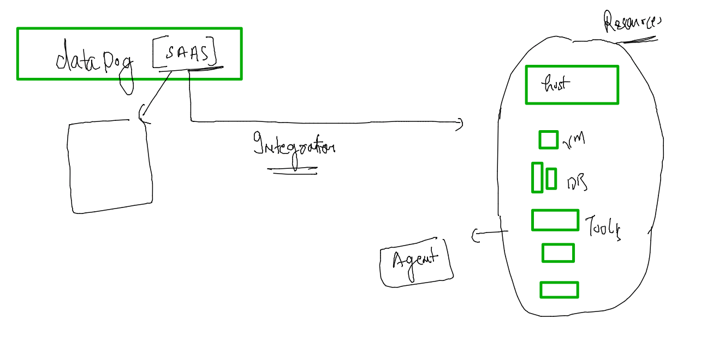

# voda-datadog-11thjuly2022


### Monitoring 


### Observalibity vs monitoring 


### pillers of OBservability 


### datadog introduction 


### pricing 


### application Infra 


### planning infro in aws cloud 

### connecting linux vm via ssh 

```
fire@ashutoshhs-MacBook-Air ~ % ssh   ec2-user@184.73.12.243
The authenticity of host '184.73.12.243 (184.73.12.243)' can't be established.
ECDSA key fingerprint is SHA256:8nNOk0DD8ITpko+eOq6cAXWZdFJtxq3rPKoRe5BRoBw.
Are you sure you want to continue connecting (yes/no/[fingerprint])? yes
Warning: Permanently added '184.73.12.243' (ECDSA) to the list of known hosts.
ec2-user@184.73.12.243: Permission denied (publickey,gssapi-keyex,gssapi-with-mic).
fire@ashutoshhs-MacBook-Air ~ % 


```

### give hostname to your VM 

```
[ec2-user@ip-172-31-18-110 ~]$ sudo -i 
[root@ip-172-31-18-110 ~]# whoami
root
[root@ip-172-31-18-110 ~]# hostnamectl set-hostname  ashu-vm 
[root@ip-172-31-18-110 ~]# exit
logout
[ec2-user@ip-172-31-18-110 ~]$ sudo -i
[root@ashu-vm ~]# 
[root@ashu-vm ~]# 


```

### datadog agent 



### amazon linux based agent v7 selection 


### by script we are installing datadog agent v7 

```
[root@ashu-vm ~]# DD_AGENT_MAJOR_VERSION=7 DD_API_KEY=8b7fcbeb66ba4b15ffee91697921f15d DD_SITE="datadoghq.com" bash -c "$(curl -L https://s3.amazonaws.com/dd-agent/scripts/install_script.sh)"
  % Total    % Received % Xferd  Average Speed   Time    Time     Time  Current
                                 Dload  Upload   Total   Spent    Left  Speed
100 29326  100 29326    0     0   793k      0 --:--:-- --:--:-- --:--:--  818k

* Datadog Agent install script v1.9.0


* Installing YUM sources for Datadog

* Installing the Datadog Agent package

Failed to set locale, defaulting to C
Loaded plugins: extras_suggestions, langpacks, priorities, update-motd
Cleaning repos: amzn2-core amzn2extra-docker amzn2extra-kernel-5.10 datadog
17 metadata files removed
6 sqlite files removed
0 metadata files removed
  Installing package: datadog-agent


```

### final check 

```
Installed:
  datadog-agent.x86_64 1:7.37.1-1                                               

Complete!

* Adding your API key to the Datadog Agent configuration: /etc/datadog-agent/datadog.yaml


* Setting SITE in the Datadog Agent configuration: /etc/datadog-agent/datadog.yaml

/bin/systemctl
* Starting the Datadog Agent...


Your Datadog Agent is running and functioning properly. It will continue
to run in the background and submit metrics to Datadog.

If you ever want to stop the Datadog Agent, run:

     systemctl stop datadog-agent

And to run it again run:

     systemctl start datadog-agent


```

### checking configuration file of datadog agent 

```
[root@ashu-vm ~]# cd  /etc/datadog-agent/
[root@ashu-vm datadog-agent]# 
[root@ashu-vm datadog-agent]# 
[root@ashu-vm datadog-agent]# 
[root@ashu-vm datadog-agent]# ls
auth_token    conf.d                install_info                 selinux
checks.d      datadog.yaml          runtime-security.d           system-probe.yaml.example
compliance.d  datadog.yaml.example  security-agent.yaml.example

```

### start / checking datadog agent service 

```
[root@ashu-vm datadog-agent]# systemctl status datadog-agent 
● datadog-agent.service - Datadog Agent
   Loaded: loaded (/usr/lib/systemd/system/datadog-agent.service; enabled; vendor preset: disabled)
   Active: active (running) since Mon 2022-07-11 06:32:48 UTC; 5min ago
 Main PID: 693 (agent)
   CGroup: /system.slice/datadog-agent.service
           └─693 /opt/datadog-agent/bin/agent/agent run -p /opt/datadog-agent/run/agent.pid


```


